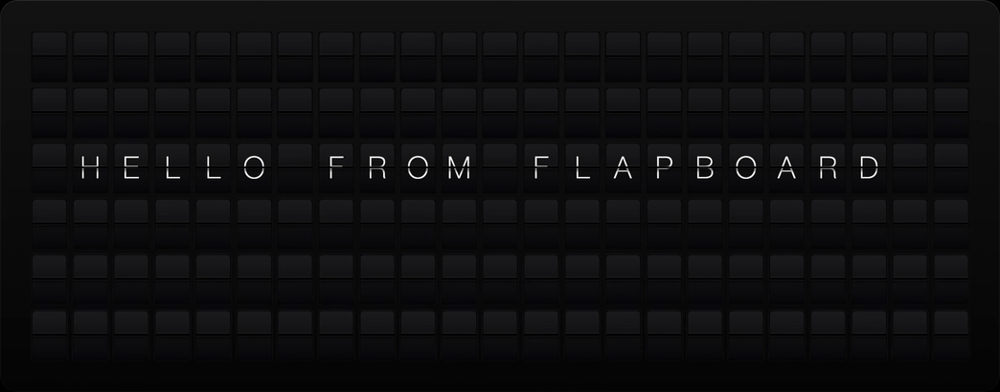

# flapboard

A split-flap display engine for your browser.



The board is modelled as a **state machine of autonomous motors**, not a set of CSS transitions.

There is a single piece of truth; the _target_ grid. A single animation loop drives the display. Every cell is modeled as an independent motor with its own current flap, its own clock, and its own jitter, so the desync that reads as "alive" is the default rather than something faked on top.

`setTarget` is **fully interruptible**: it never moves a motor's current position, only changes it's end destination.

Change the message mid-flip and every tile redirects toward the new message from wherever it physically is. State changes _flow_ across the board instead of jumping.

The core is framework-agnostic (no DOM beyond an injectable clock + rAF). A React view ships alongside it.

## Usage (React)

```tsx
import { FlapBoard } from "@vybhavab/flapboard/react";
import "@vybhavab/flapboard/styles.css";

<FlapBoard
  rows={6}
  cols={23}
  text="HELLO WORLD"
  frame={["#C8102E", "#FFFFFF", "#012169"]}
/>;
```

Change `text`, `lines`, `frame`, or `layers` and the board animates to the new target — interrupt it any time. `onSettled` fires when the board comes to rest; `onTick` fires per flip (wire a click sound here).

### Easy props

Use `text` for balanced wrapping, `lines` when the board copy is already pinned,
and `frame` for a perimeter colour sequence:

```tsx
<FlapBoard
  rows={6}
  cols={23}
  lines={["ARRIVALS", "GATE 22", "ON TIME"]}
  frame={["#C8102E", "#FFFFFF", "#012169"]}
/>
```

`align`, `valign`, and `wrap` tune placement inside the board's target region. These props are just shorthand for a declaration with one text layer and, if present, one frame layer.

### Layers

For anything with multiple pieces of content, pass a `layers` declaration. A declaration is plain data: each layer targets an explicit cell region, resolution walks the array in order, and the last layer covering a cell wins. Nothing auto-insets another layer; if text should sit inside a frame, give that text an inside region.

```ts
import { frame, region, text } from "@vybhavab/flapboard";

const palette = ["#C8102E", "#FFFFFF", "#012169"];
const layers = [
  frame(palette),
  ...region({ row: 1, col: 1, rows: 2, cols: 21 }, [
    text({ lines: ["ARRIVALS"] }),
  ]),
  ...region({ row: 4, col: 1, rows: 1, cols: 21 }, [text("GATE 22")]),
];
```

```tsx
<FlapBoard rows={6} cols={23} layers={layers} />
```

The builders are convenience only. You can build the same `Layer[]` yourself when the declaration comes from an API, database, or test fixture.

### Resolve and inspect

Use the framework-agnostic helpers when you need to test or debug without a browser:

```ts
import { gridToText, resolve } from "@vybhavab/flapboard";

const grid = resolve(layers, { rows: 6, cols: 23, idealLineCols: 16 });
expect(gridToText(grid).join("\n")).toContain("ARRIVALS");
```

`resolve` produces the exact `Flap[][]` target grid that the engine will animate to. `gridToText` gives agents and tests a readable substitute for inspecting the rendered board.

### Motion policy

If the board sits in a scrollable page, a full-board cascade can compete with scrolling for paint/compositor budget. The default behavior is to keep the physical cascade uninterrupted, but you can opt into a scroll-responsive motion policy:

```tsx
import { type FlapBoardMotion } from "@vybhavab/flapboard/react";

const scrollResponsiveMotion: FlapBoardMotion = { whileScrolling: "finish" };

<FlapBoard text="HELLO WORLD" motion={scrollResponsiveMotion} />;
```

`whileScrolling: "finish"` snaps active motors to their target when the page scrolls. Use it when scroll responsiveness is more important than completing every visible flap.

### Theming

The board is un-opinionated by design: every colour, gradient, radius, shadow and the flap texture is a `--sf-*` CSS custom property, declared with a default on `.sf-board`. The defaults are the `flapboard` house look (a Vestaboard-style stealth slab), so an un-themed board is unchanged.

Pick a shipped preset with the `theme` prop:

```tsx
<FlapBoard text="HELLO WORLD" theme="flipflap" />
```

| theme         | look                                                                                               |
| ------------- | -------------------------------------------------------------------------------------------------- |
| `"flapboard"` | default house look — a Vestaboard-style stealth slab where tiles melt into the board               |
| `"flipflap"`  | lighter, crisply-outlined flaps with a ridged lower leaf, after [flipflap.io](https://flipflap.io) |

A preset is nothing but a block of token overrides — the engine, layout and flap physics are identical across themes. Override any token from the host app for full control (the `theme` prop sets `data-flap-theme`, which only raises specificity over the defaults):

```css
.sf-board {
  --sf-cell-bg: #1a1a1c;
  --sf-text-color: #fff;
  --sf-cell-radius: 6px;
}
```

The main tokens: `--sf-board-bg` / `-radius` / `-pad` / `-gap` / `-shadow`,
`--sf-cell-bg` / `-radius` / `-shadow`, `--sf-top-bg`, `--sf-bottom-bg`,
`--sf-flap-texture` (an image layer over the lower leaf), `--sf-hinge-bg` /
`-shadow`, `--sf-text-color` / `-weight` / `-tracking`, `--sf-mark-color`, and
`--sf-font`. See `src/styles.css` for the full list and defaults.

The rendered DOM keeps stable hooks for custom skins:
`data-flap-board`, `data-flap-cell`, `data-flap-unit`, `data-flap-face`,
`data-flap-kind`, `data-flap-state`, and `data-flap-theme`. The bundled
stylesheet is optional; consumers can skip it and skin those hooks with their own CSS or Tailwind utilities.

To ship a new preset, add a `[data-flap-theme="..."]` block in `styles.css` and the name to the `FlapTheme` union.

### Custom glyph marks

A few characters read better drawn than set in a typeface. `-` and `>` ship as SVG marks by default ({@link DEFAULT_MARKS}); pass `marks` to add or override — the map is merged over the defaults, keyed by the (uppercased) character:

```tsx
import { FlapBoard, type GlyphMark } from "@vybhavab/flapboard/react";

const arrow: GlyphMark = ({ className }) => (
  <svg className={className} viewBox="0 0 100 100" aria-hidden="true">
    <line className="sf-mark" x1="26" x2="74" y1="50" y2="50" />
    <polyline className="sf-mark" points="56,32 78,50 56,68" fill="none" />
  </svg>
);

<FlapBoard text="GATE → 22" marks={{ "→": arrow }} />;
```

### Deterministic animation (`random`)

The motor jitter is the only nondeterminism in the engine, and it's injectable. Pass `random` (a `() => number` PRNG) to make a board animate identically every run — this is how the visual tests get pixel-stable frames. Defaults to `Math.random`.

## Usage (engine only)

```ts
import { FlapBoardEngine, resolve, text } from "@vybhavab/flapboard";

const board = new FlapBoardEngine({ rows: 6, cols: 23, onSettled: () => {} });
board.subscribeCell(0, 0, (e) => paint(e));
board.setTarget(
  resolve([text("HELLO")], { rows: 6, cols: 23, idealLineCols: 16 })
);
board.setTarget(
  resolve([text("WORLD")], { rows: 6, cols: 23, idealLineCols: 16 })
); // interrupts the first
```

`setTarget(grid)` is the raw escape hatch: if you already have a `Flap[][]`, pass it directly and skip declarations, builders, and React entirely.

## Design notes

- **Uppercase-only drum.** The board displays uppercase, so the drum carries a
  single letter run; flap values are uppercased. No redundant lowercase block to
  spin through.
- **Colours at the front of the drum.** The frame border lands in a couple of
  steps instead of a full alphabet spin.
- **Near-black frame stripes render as blank** — invisible on a dark board, and
  no colour flap to spin to.
- **Re-seeded jitter per spin** (start delay, step speed, fold duration), so the
  board never animates the same way twice.

## Development & tests

The package is a standalone pnpm project with build, quality, and test suites.

```bash
pnpm --filter @vybhavab/flapboard build          # tsup -> dist (esm + .d.ts + styles.css)
pnpm --filter @vybhavab/flapboard test:unit      # Vitest, runs in plain Node (no DOM)
pnpm --filter @vybhavab/flapboard test:visual    # Playwright, real Chromium
```

Local consumers can link this repo during development, while deployed apps should install the published npm package. `dist` is the publishable artifact.

### Unit tests (Vitest)

The engine, drum, layout and timing modules are DOM-free — the engine takes an injectable clock, rAF and `random` — so the logic suite runs in Node with a manual clock and a seeded PRNG (`test/support/rng.ts`). No jsdom.

### Visual tests (Playwright)

`test/harness/` is a tiny Vite page that mounts the real view and exposes a deterministic driver on `window.__flap` (seeded RNG + a manual clock installed over `requestAnimationFrame`/`performance.now`). `test/visual/board.spec.ts` captures settled boards across scenarios; `test/visual/onion-skin.spec.ts` drives one transition frame-by-frame and composites the cascade frames into a single onion-skin still (`test/onion-skin.ts`, via `sharp`) that is both attached to the report and snapshot-compared.

```bash
pnpm --filter @vybhavab/flapboard test:visual:update   # (re)generate baselines
```

Baselines are committed per platform (`…-chromium-darwin.png`, `…-chromium-linux.png`). CI runs in the version-matched Playwright Linux container; the first run on a new platform has no baselines yet — grab the `flapboard-visual` artifact, commit the generated `*-linux.png` files, and re-run.

## Releases

This repo uses Changesets for npm releases and pkg.pr.new for preview packages.

```bash
pnpm changeset          # add a release note
pnpm version            # apply pending changesets
pnpm release            # build and publish to npm
```

Pull requests get preview packages through pkg.pr.new after CI builds the package. The preview workflow uses `pnpm exec pkg-pr-new publish --comment=update --packageManager=pnpm`, matching pkg.pr.new's guidance to run from the lockfile in CI.
